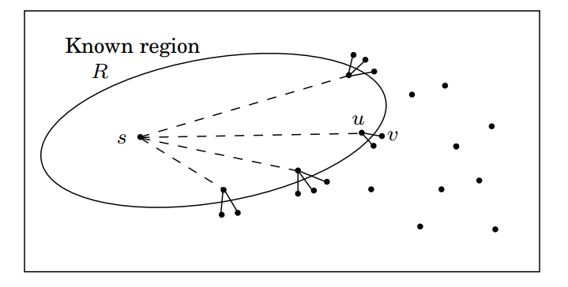
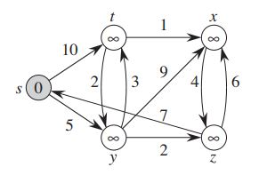
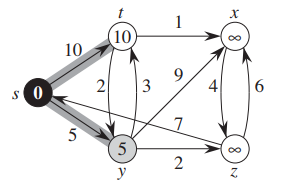
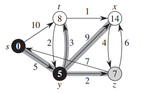
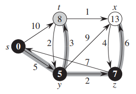
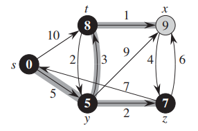
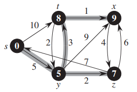

狄克斯特拉（Dijkstra）算法的Python语言实现
==========================================

Dijkstra算法主要用于解决单源点最短路径问题。该算法有如下特点：

- 可以处理有向图或无向图（大部分算法教材只提到有向图）；
- 要求图中的任何边的权重都是正的；
- 方法简单，但很强大，是贪心设计模式的例子。

算法导论中Dijkstra的伪码是基于优先级队列来实现的，不过优先级队列本身就可以用一篇文章来介绍，
所以我这里结合了其他教材中的介绍，希望以更容易理解和记忆的方式介绍Dijkstra算法。

首先，我们先给出Dijkstra算法的伪码，然后，通过具体的例子（一张带边权重的有向图）
来具体的分析Dijkstra算法，并同时给出对应的Python实现。

伪代码如下：  

<u>procedure dijkstra</u>(G, l, s):
Input:  Graph G = (V, E), directed or undirected;  
&emsp;&emsp;&emsp;positive edge lengths {$l_e : e \in E$}; vertex $s \in V$  
Output: For all vertices u reachable from s, dist(u) is set  
&emsp;&emsp;&emsp;&emsp;to the distance from s to u.  

Initialize dist(s) to 0, other dist($\cdot$) values to $\infty$  
Initialize prev($\cdot$) to NIL  
R = { } (the "known region")  
while R $\neq$ V:  
&emsp;Pick the node u $\not\in$ R with smallest dist($\cdot$)  
&emsp;Add u to R  
&emsp;for all edges (u, v) $\in$ E and u $\in$ R and v $\not\in$ R:  
&emsp;&emsp;if dist(v) > dist(u) + l(u, v):  
&emsp;&emsp;&emsp;dist(v) = dist(u) + l(u, v)  
&emsp;&emsp;&emsp;prev(v) = u  

以上伪码什么意思呢？就是，从起始顶点s开始向外扩张，持续不断地扩展图的已知最短路径的区域R，直至所有顶点。
而顶点加入区域R的顺序，是按照它们与s的距离的顺序：先加入最近的顶点，然后加入更远一些的顶点。
更确切地说，若“已知区域”是包含s的某个顶点子集R，下一个加入该子集的顶点应该是在R之外同时离s最近的顶点。
我们记该顶点为v；问题是：如何确定该顶点？

为了回答该问题，考虑顶点u，它是从s到v的最短路径上的前一顶点，即s $\to \cdots \to$ u $\to$ v。
由于所有边的权重都是正的，因此u一定比v距离s更近，这意味着u在R中 -- 否则将与v是R之外且与s距离最近的顶点这一
假设相矛盾。因此，从s到v的最短路径即为这样的一条路径，它是基于一条已知最短路径中的某条边的扩展路径。如图，



但是通常会有关于当前最短路径集合的很多单边的扩展；其中哪一条确定了v呢？应该是这些扩展路径中的最短路径。
这是因为，如果存在一条更短的单边扩展路径，又将再次与v是R之外且与s距离最近的顶点这一假设相矛盾。
因此，很容易就能找到v：它是R之外的这样一个顶点，当u在R的范围内变动时，该顶点使得dist(u)+l(u,v)的值最小。
换言之，检查当前已知最短路径的所有单边扩展路径，找到这些扩展路径的最短路径，该路径的端点即为加入R的下一个顶点。

以上就是伪码的解释，至于算法的正确性证明，可以在参考文档中找到，这里就不再照搬了。
另外，如果在上述代码的基础上增加优先队列操作，就回到了算法导论中Dijkstra的算法。

下面，我们给出一张具体的图，然后结合这张图给出Dijkstra算法的Python实现。



该图在如下Python代码中，以邻接表的方式表示，这里为简化代码，并没有自己封装Graph类，而是使用了Python内置的字典类。

```python
graph = dict() 
graph['s'] = {'t': 10, 'y': 5} 
graph['t'] = {'x': 1, 'y': 2} 
graph['x'] = {'z': 4} 
graph['y'] = {'t': 3, 'x': 9, 'z': 2} 
graph['z'] = {'s': 7, 'x': 6} 
```

另外，算法伪码中还用到了两个数据结构的对象，一个是区域R的顶点集合，另一个是存放最短距离表。

区域R的顶点集合我们用Python的列表表示：

```python
included_vertices = list()
```

存放最短距离表包括三列，分别是顶点，最短距离，最短路径上的前一个（previous）顶点，

| vertex | distance | previous |
| ------ | -------- | -------- |
| s      | $\infty$ | NIL      |
| t      | $\infty$ | NIL      |
| x      | $\infty$ | NIL      |
| y      | $\infty$ | NIL      |
| z      | $\infty$ | NIL      |

而存放最短距离表则还是Python内置的字典类，其中key对应顶点列，value是个元组，包含距离和前一顶点。

```python
table = dict() 
table = { 
        's': [float("inf"), None], 
        't': [float("inf"), None], 
        'x': [float("inf"), None], 
        'y': [float("inf"), None], 
        'z': [float("inf"), None], 
}
```

接下来，我们把伪码直译成Python代码：

```python
def dijkstra(graph, table, origin): 
    initialize_distance_table(table, origin)
    included_vertices = list()
    while len(included_vertices) < len(table.keys()):
        current_node = get_shortest_unincluded_vertex(table, included_vertices)
        included_vertices.append(current_node)
        adjacent_nodes = graph[current_node]
        for vertex in set(adjacent_nodes).difference(set(included_vertices)):
            current_distance = get_distance(table, vertex)
            new_distance = get_distance(table, current_node) + edge_length(graph, current_node, vertex) 
            if new_distance < current_distance:
                set_distance(table, vertex, new_distance)
                set_previous(table, vertex, current_node)
    return table
```

我们逐行拆解代码：

代码
```python
    initialize_distance_table(table, origin)
```
对应的是  
Initialize dist(s) to 0, other dist($\cdot$) values to $\infty$  
Initialize prev($\cdot$) to NIL  
这两行伪码的工作，initialize_distance_table的具体实现如下：

```python
def initialize_distance_table(table, origin):
    for vertex in table.keys():
        if vertex == origin:
            table[vertex] = [0, None]
        else:
            table[vertex] = [float('inf'), None]
    return table
```

代码
```python
    included_vertices = list()
```
对应的是  
R = { } (the "known region")  
这行伪码的工作


代码
```python
    while len(included_vertices) < len(table.keys()):
```
对应的是  
while R $\neq$ V:  
这行伪码的工作

在我们的例子中，源顶点是s，所以`origin = 's'`
当代码第一次执行到`while len(included_vertices) < len(table.keys()):`这行时，  
R = { } (the "known region")  
即`included_vertices = []`  

距离表的内容是这样的：

| vertex | distance | previous |
| ------ | -------- | -------- |
| s      | 0        | NIL      |
| t      | $\infty$ | NIL      |
| x      | $\infty$ | NIL      |
| y      | $\infty$ | NIL      |
| z      | $\infty$ | NIL      |

图的遍历情况是这样的：


代码
```python
        current_node = get_shortest_unincluded_vertex(table, included_vertices)
```
对应的是  
&emsp;Pick the node u $\not\in$ R with smallest dist($\cdot$)  
这行伪码的工作，get_shortest_unincluded_vertex的具体实现如下：

```python
# DISTANCE = 1
def get_shortest_unincluded_vertex(table, included_vertices): 
    unincluded_vertices = list(set(table.keys()).difference(set(included_vertices))) 
    assumed_min = table[unincluded_vertices[0]][DISTANCE] 
    min_vertex = unincluded_vertices[0] 
    for node in unincluded_vertices: 
        if table[node][DISTANCE] < assumed_min: 
            assumed_min = table[node][DISTANCE] 
            min_vertex = node 
    return min_vertex 
```

第一次执行完`current_node = get_shortest_unincluded_vertex(table, included_vertices)`这行时，`current_node = 's'`

代码
```python
        included_vertices.append(current_node)
```
对应的是  
&emsp;Add u to R  
这行伪码的工作

第一次执行到`included_vertices.append(current_node)`这行时，`included_vertices = ['s']`

代码
```python
        adjacent_nodes = graph[current_node]`和  
        for vertex in set(adjacent_nodes).difference(set(included_vertices)):
```
对应的是  
&emsp;for all edges (u, v) $\in$ E and u $\in$ R and v $\not\in$ R:  
这行伪码的工作

由于Python实现是通过邻接表的方式表示图的，所以Python代码中先获取current_node（伪码中的u顶点）的所有邻接节点，然后通过集合差集减去included_vertices（伪码中的区域R的顶点集），然后就能得到伪码中的边集。

第一次执行到`for vertex in set(adjacent_nodes).difference(set(included_vertices)):`这行时，相当于执行了`for vertex in ['t', 'y']`


代码
```python
            current_distance = get_distance(table, vertex)
            new_distance = get_distance(table, current_node) + edge_length(graph, current_node, vertex) 
            if new_distance < current_distance:
                set_distance(table, vertex, new_distance)
                set_previous(table, vertex, current_node)
```
对应的是  
&emsp;&emsp;if dist(v) > dist(u) + l(u, v):  
&emsp;&emsp;&emsp;dist(v) = dist(u) + l(u, v)  
&emsp;&emsp;&emsp;prev(v) = u  
这三行伪码的工作，其中，为了代码可读性，封装了几个helper函数，函数定义如下：

```python
DISTANCE = 0 
PREVIOUS = 1 

def get_distance(table, vertex):
    return table[vertex][DISTANCE] 

def set_distance(table, vertex, new_distance): 
    table[vertex][DISTANCE] = new_distance 
        
def set_previous(table, vertex, previous_node): 
    table[vertex][PREVIOUS] = previous_node 

def edge_length(graph, from_vertex, to_vertex): 
    return graph[from_vertex][to_vertex] 
```

而第一次`while len(included_vertices) < len(table.keys()):`循环迭代结束后，  
`included_vertices = ['s']` # R = {s} 

距离表的内容是这样的：

| vertex | distance | previous |
| ------ | -------- | -------- |
| s      | 0*       | NIL      |
| t      | 10       | s        |
| x      | $\infty$ | NIL      |
| y      | 5        | s        |
| z      | $\infty$ | NIL      |

图的遍历情况是这样的：



而第二次执行完`current_node = get_shortest_unincluded_vertex(table, included_vertices)`这行时，`current_node = 'y'`

而第二次`while len(included_vertices) < len(table.keys()):`循环迭代结束后，  
`included_vertices = ['s', 'y']` # R = {s, y} 

距离表的内容是这样的：

| vertex | distance | previous |
| ------ | -------- | -------- |
| s      | 0*       | NIL      |
| t      | 8        | y        |
| x      | 14       | y        |
| y      | 5*       | s        |
| z      | 7        | y        |

图的遍历情况是这样的：



而第三次执行完`current_node = get_shortest_unincluded_vertex(table, included_vertices)`这行时，`current_node = 'z'`

而第三次`while len(included_vertices) < len(table.keys()):`循环迭代结束后，  
`included_vertices = ['s', 'y', 'z']` # R = {s, y, z} 

距离表的内容是这样的：

| vertex | distance | previous |
| ------ | -------- | -------- |
| s      | 0*       | NIL      |
| t      | 8        | y        |
| x      | 13       | z        |
| y      | 5*       | s        |
| z      | 7*       | y        |

图的遍历情况是这样的：



而第四次执行完`current_node = get_shortest_unincluded_vertex(table, included_vertices)`这行时，`current_node = 't'`

而第四次`while len(included_vertices) < len(table.keys()):`循环迭代结束后，  
`included_vertices = ['s', 'y', 'z', 't']` # R = {s, y, z, t} 

距离表的内容是这样的：

| vertex | distance | previous |
| ------ | -------- | -------- |
| s      | 0*       | NIL      |
| t      | 8*       | y        |
| x      | 9        | t        |
| y      | 5*       | s        |
| z      | 7*       | y        |

图的遍历情况是这样的：



而第五次执行完`current_node = get_shortest_unincluded_vertex(table, included_vertices)`这行时，`current_node = 'x'`

而第五次`while len(included_vertices) < len(table.keys()):`循环迭代结束后，  
`included_vertices = ['s', 'y', 'z', 't', 'x']` # R = {s, y, z, t, x} 

距离表的内容是这样的：

| vertex | distance | previous |
| ------ | -------- | -------- |
| s      | 0*       | NIL      |
| t      | 8*       | y        |
| x      | 9*       | t        |
| y      | 5*       | s        |
| z      | 7*       | y        |

图的遍历情况是这样的：



至此，R = V，等第六次`while len(included_vertices) < len(table.keys()):`判断时，条件为假，退出循环，dijkstra算法结束。

最终，我们用Python打印结果，

```python
shortest_distance_table = dijkstra(graph, table, 's') 

for k in sorted(shortest_distance_table): 
    print("{} - {}".format(k,shortest_distance_table[k])) 
```

会得到如下输出
```
s - [0, None]
t - [8, 'y']
x - [9, 't']
y - [5, 's']
z - [7, 'y']
```

最后给出完成的Python示例代码

```python
def get_shortest_distance(table, vertex): 
    shortest_distance = table[vertex][DISTANCE] 
    return shortest_distance 
    
def set_shortest_distance(table, vertex, new_distance): 
    table[vertex][DISTANCE] = new_distance 
        
def set_previous_node(table, vertex, previous_node): 
    table[vertex][PREVIOUS_NODE] = previous_node 

def get_distance(graph, first_vertex, second_vertex): 
    return graph[first_vertex][second_vertex] 
        
def get_next_node(table, visited_nodes): 
    unvisited_nodes = list(set(table.keys()).difference(set(visited_nodes))) 
    assumed_min = table[unvisited_nodes[0]][DISTANCE] 
    min_vertex = unvisited_nodes[0] 
    for node in unvisited_nodes: 
        if table[node][DISTANCE] < assumed_min: 
            assumed_min = table[node][DISTANCE] 
            min_vertex = node 
    return min_vertex 

def find_shortest_path(graph, table, origin): 
    visited_nodes = [] 
    current_node = origin 
    starting_node = origin 
    while True: 
        adjacent_nodes = graph[current_node] 
        if set(adjacent_nodes).issubset(set(visited_nodes)): 
            # Nothing here to do. All adjacent nodes have been visited. 
            pass 
        else: 
            unvisited_nodes = set(adjacent_nodes).difference(set(visited_nodes)) 
            for vertex in unvisited_nodes: 
                distance_from_starting_node = get_shortest_distance(table, vertex) 
                if distance_from_starting_node == INFINITY and current_node == starting_node: 
                    total_distance = get_distance(graph, vertex, current_node) 
                else: 
                    total_distance = get_shortest_distance (table, 
                    current_node) + get_distance(graph, current_node, vertex) 
                if total_distance < distance_from_starting_node: 
                    set_shortest_distance(table, vertex, total_distance) 
                    set_previous_node(table, vertex, current_node) 
        visited_nodes.append(current_node) 
        #print(visited_nodes)
        if len(visited_nodes) == len(table.keys()): 
            break 
        current_node = get_next_node(table,visited_nodes) 
    return(table)

graph = dict() 
graph['A'] = {'B': 5, 'D': 9, 'E': 2} 
graph['B'] = {'A': 5, 'C': 2} 
graph['C'] = {'B': 2, 'D': 3} 
graph['D'] = {'A': 9, 'F': 2, 'C': 3} 
graph['E'] = {'A': 2, 'F': 3} 
graph['F'] = {'E': 3, 'D': 2} 

table = dict() 
table = { 
        'A': [0, None], 
        'B': [float("inf"), None], 
        'C': [float("inf"), None], 
        'D': [float("inf"), None], 
        'E': [float("inf"), None], 
        'F': [float("inf"), None], 
}


DISTANCE = 0 
PREVIOUS_NODE = 1 
INFINITY = float('inf')  

shortest_distance_table = find_shortest_path(graph, table, 'A') 


for k in sorted(shortest_distance_table): 
    print("{} - {}".format(k,shortest_distance_table[k])) 
```

另外，想看C++版本的代码可以去下方链接  
[Dijkstra算法C++实现](https://github.com/hexu1985/Data.Structures.And.Algorithms.Tutorial/tree/master/dijkstra/recipe-01/cxx)

### 参考文档：

- 《 算法导论（Introduction to Algorithms, Third Edition）》
- 《 算法概论 》
- 《 数据结构 Python语言描述 》
- 《 算法详解（卷2）图算法和数据结构 》
- 《 Python数据结构和算法实战(第2版) 》
